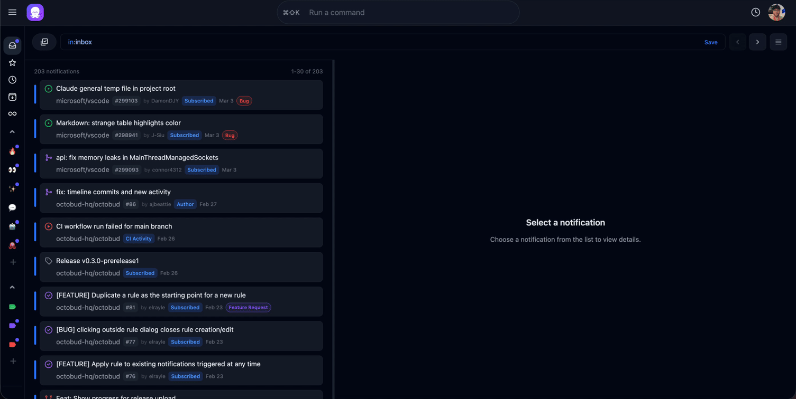

<p align="center">
  <picture>
    <source media="(prefers-color-scheme: dark)" srcset="frontend/static/baby_octo.svg">
    <source media="(prefers-color-scheme: light)" srcset="frontend/static/baby_octo_dark.svg">
    
  </picture>
</p>

<h1 align="center">Octobud</h1>

<p align="center">
  <strong>Superfast GitHub Notification Inbox.</strong>
</p>

<p align="center">
  <a href="#features">Features</a> •
  <a href="#quick-start">Quick Start</a> •
  <a href="#documentation">Documentation</a> •
  <a href="#contributing">Contributing</a>
</p>

<p align="center">
  <a href="https://github.com/octobud-hq/octobud/releases/latest">
    
  </a>
</p>

<p align="center">
  <a href="https://github.com/octobud-hq/octobud/actions/workflows/ci.yml?query=branch%3Amain"></a>
  <a href="LICENSE.txt"></a>
  <a href="https://github.com/octobud-hq/octobud"></a>
</p>

---

Octobud is a Mac desktop application that helps you manage the flood of GitHub notifications with filtering, custom views, keyboard shortcuts, and automation rules.

Built with **Go** and **Svelte 5**. Runs as a single binary with SQLite - no external dependencies required. On macOS, Octobud runs as a menu bar app that opens your browser to a local web interface.

### Platform Support

- **macOS**: Full support with menu bar integration, auto-start, and secure Keychain storage for GitHub credentials
- **Linux & Windows**: Core functionality works, but menu bar integration and auto-start are not available. GitHub credentials are encrypted at rest, **but the encryption key is stored locally, so an attacker with machine access could decrypt them**. Keychain support is planned for a future release.

## Why?

If you manage many GitHub notifications, you know that organizing and triaging them efficiently can be a major challenge.

Octobud builds on GitHub's notification system and provides a smart, dedicated inbox experience: rich filtering and querying, custom views, keyboard shortcuts, automation rules, and more, all running locally on your machine.

## Features



#### ⚡ Super Fast Loading
Issue, PR, and Discussion data is stored locally for instant lookup and filtering

#### 📜 Rich Timeline
See the full story of an issue or PR: commits, reviews, comments, and status changes

#### 📥 Full Lifecycle Management
Star, Snooze, Archive, Tag, and Mute notifications

### More

| Feature | Description |
|---------|-------------|
| **Rich Querying** | Filter with a powerful query language |
| **Custom Views** | Create saved filtered views for your workflow |
| **Automation Rules** | Filter, tag, archive and more with query-based rules |
| **Keyboard-First** | Vim-style navigation and intuitive shortcuts |
| **Desktop Notifications** | Never miss a review request or issue reply |
| **Inline Details** | View issue and PR status, comments, and more inline |
| **Split Pane Mode** | View details side by side with your inbox |
| **Tags** | Organize with custom tags and colors |
| **Real-Time Sync** | Background sync keeps everything up to date |
| **Privacy-First** | Local-first, your data stays on your machine |

## Quick Start

### macOS

**[Download Latest Release](https://github.com/octobud-hq/octobud/releases/latest)** - Download the `.pkg` installer for your Mac (Apple Silicon or Intel). Octobud will appear in your menu bar and open automatically in your browser.

### Linux & Windows (Build from Source)

Official releases with embedded assets are currently only available for macOS. For Linux and Windows, you must build from source (see below). The app will be accessible at `http://localhost:8808` in your browser. Note: Menu bar integration and auto-start are not available on these platforms.

**Note:** Keychain support is not yet implemented on Linux and Windows. Your GitHub OAuth token or PAT will be encrypted at rest, but because the encryption key will be stored in plain text, anyone with access to your machine can still get your token. 

### Build from Source

**Prerequisites:** [Go 1.26+](https://go.dev/dl/) and [Node.js 24+](https://nodejs.org/)

```bash
git clone https://github.com/octobud-hq/octobud.git && cd octobud
make build
./bin/octobud
```

🎉 That's it! On macOS, Octobud will appear in your menu bar and open in your browser. On Linux and Windows, open `http://localhost:8808` manually. Connect your GitHub account using either **OAuth** or a **Personal Access Token (PAT)**. Both methods work equally well - choose OAuth for convenience, or PAT if your organization disables OAuth apps or you have multiple GitHub orgs. See the [OAuth Setup Guide](docs/guides/oauth-setup.md) or [Personal Access Token Setup Guide](docs/guides/personal-access-token-setup.md) for detailed instructions.

<details>
<summary><strong>More options</strong></summary>

### Development Mode (Frontend Hot Reload)

Run the backend and frontend separately for hot reload during development:

```bash
# Terminal 1: Backend
make backend-dev

# Terminal 2: Frontend
make frontend-dev
```

Open `http://localhost:5173`

### Command Line Options

```bash
./bin/octobud --help
  -port int        Port to listen on (default 8808)
  -data-dir string Data directory (default: platform-specific)
  -no-open         Don't open browser on startup
  -version         Show version and exit
```

</details>

## After Installation

When you first launch Octobud, you'll be guided through setup:

1. **Connect GitHub** - You'll be prompted to connect your GitHub account. Choose either **OAuth** or a **Personal Access Token (PAT)**. Both methods work equally well:
   - **OAuth** - Convenient and secure, uses GitHub's device flow
   - **PAT** - Recommended if your organization disables OAuth apps or you have multiple GitHub orgs
   
   Both require the following scopes:
   - `repo`
   - `notifications`
   - `read:discussions` (this permission is only required for PAT)
   
   See the [OAuth Setup Guide](docs/guides/oauth-setup.md) or [Personal Access Token Setup Guide](docs/guides/personal-access-token-setup.md) for detailed instructions. You can update your authentication method later in Settings → Account.

2. **Configure Initial Sync** - Next, you'll be prompted to configure how far back to sync notifications. Start small (30 days) - you can always [sync more later](docs/start-here.md#syncing-more-later).

3. **Learn the basics** - Press `h` for keyboard shortcuts, or see [Start Here](docs/start-here.md).

### Recommended Starting Views and Rules

Here are some recommended views and rules to help you get started:

**Views:**

- **Assigned / Authored** - `in:inbox,filtered (reason:assign OR author:<YOUR_USERNAME>)`
- **Reviews** - `in:inbox,filtered reason:review_requested`

**Views with auto-filter rule:**

- **[Bots]** - `in:inbox,filtered author:[bot]` + rule to skip inbox

See the [Views & Rules guide](docs/guides/views-and-rules.md) for detailed instructions on creating views and rules.

### Reset on macOS (clean reinstall)

If you want to start over, quit Octobud and remove its local state:

```bash
osascript -e 'quit app "Octobud"' 2>/dev/null || true

rm -rf ~/Library/Application\ Support/Octobud
rm -f ~/Library/Preferences/io.octobud.plist
rm -rf ~/Library/Caches/io.octobud

osascript -e 'tell application "System Events" to delete login item "Octobud"' 2>/dev/null || true

while security delete-generic-password -s io.octobud >/dev/null 2>&1; do :; done
```

Then launch Octobud again. It starts with a fresh setup flow.

If you ran Octobud with `--data-dir`, also remove that custom directory.

## Documentation

- [Start Here](docs/start-here.md) - Initial setup and core workflows
- [OAuth Setup](docs/guides/oauth-setup.md) - Complete guide for OAuth authentication
- [Personal Access Token Setup](docs/guides/personal-access-token-setup.md) - Complete guide for PAT setup
- [Query Syntax](docs/guides/query-syntax.md) - Filter and search notifications
- [Keyboard Shortcuts](docs/guides/keyboard-shortcuts.md) - Navigate efficiently
- [Views & Rules](docs/guides/views-and-rules.md) - Organize your inbox
- [Concepts](docs/concepts/) - How syncing, queries, and actions work
- [Architecture](docs/ARCHITECTURE.md) - Technical architecture overview
- [Migration Guide](docs/MIGRATION.md) - Upgrading and database migrations

## Roadmap

See [ROADMAP.md](ROADMAP.md) for planned features.

## Contributing

We welcome contributions! Please see [CONTRIBUTING.md](docs/CONTRIBUTING.md) for guidelines.

- 🐛 [Report bugs](https://github.com/octobud-hq/octobud/issues/new?template=bug_report.md)
- 💡 [Request features](https://github.com/octobud-hq/octobud/issues/new?template=feature_request.md)
- 📖 [Improve documentation](https://github.com/octobud-hq/octobud/issues/new?template=docs.md)

## Security

Found a security vulnerability? Please report it responsibly. See [SECURITY.md](SECURITY.md) for details.

## License

Octobud is licensed under the [GNU Affero General Public License v3.0](LICENSE.txt) (AGPL-3.0).

This means you're free to use, modify, and distribute this software, but if you run a modified version as a network service, you must make the source code available to users of that service.

## Community

- 💬 [Discussions](https://github.com/octobud-hq/octobud/discussions) - Ask questions and share ideas
- 🐛 [Issue Tracker](https://github.com/octobud-hq/octobud/issues) - Report bugs and request features
- 📚 [Documentation](docs/) - Comprehensive guides and reference

## Disclaimer

Octobud is an independent, open-source project. It is **not affiliated with, endorsed by, or officially supported by GitHub, Inc.** GitHub and the GitHub logo are trademarks of GitHub, Inc.

---

<p align="center">
  Made with ❤️ by someone who wanted a better way to stay on top of GitHub notifications.
</p>
